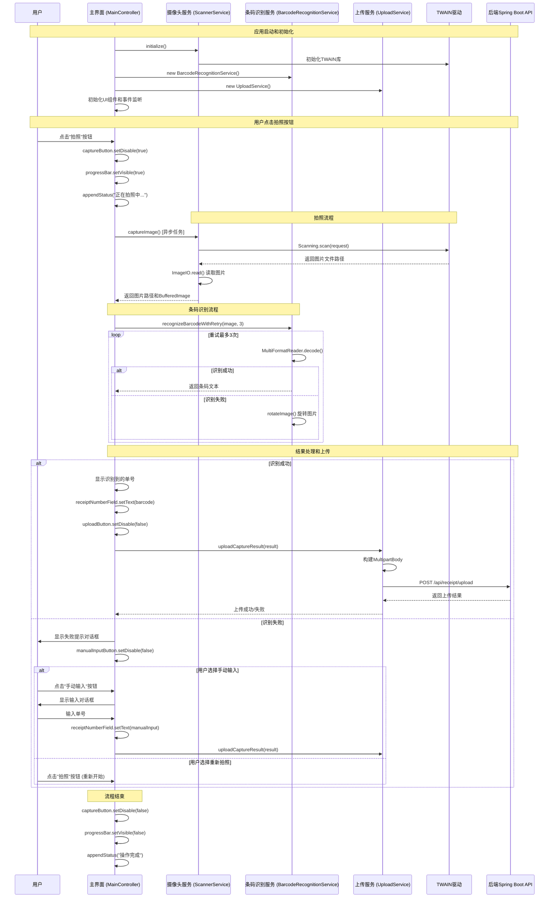
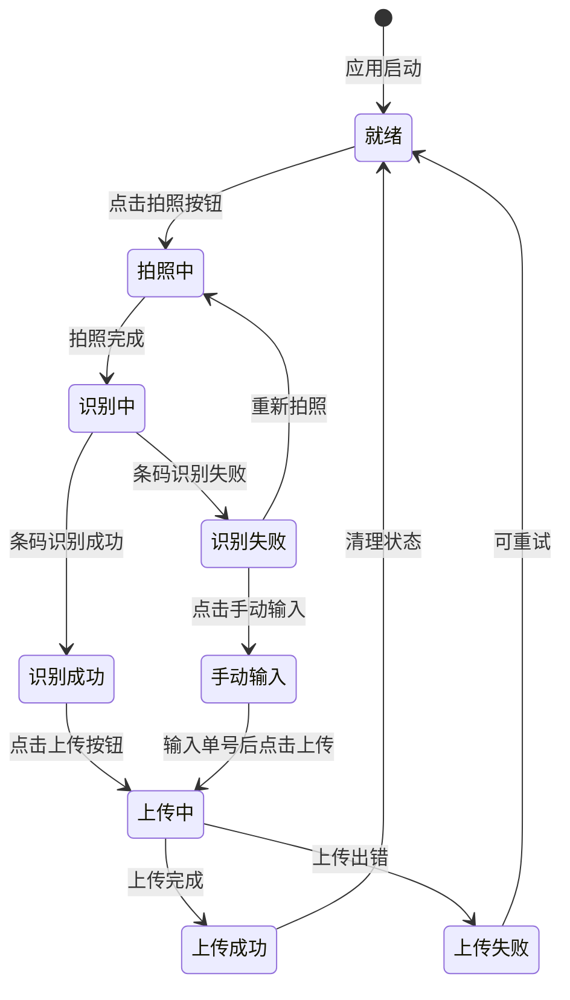

# Receipt Capture Agent 核心流程时序说明

## 完整业务流程



## 关键状态转换

### UI状态机



## 异常处理流程

### 摄像头异常
1. TWAIN 初始化失败 → 显示错误对话框，退出应用
2. 设备未连接 → 显示警告，允许重试
3. 拍照超时 → 取消操作，允许重试

### 识别异常
1. 图片质量差 → 提示重新拍照
2. 不支持的条码格式 → 提示手动输入
3. 识别超时 → 自动重试或提示手动输入

### 网络异常
1. 连接超时 → 显示错误，可重试
2. 服务器错误 → 显示错误，可重试
3. 认证失败 → 提示检查配置

## 数据流说明

### 输入数据流
```
用户操作 → JavaFX事件 → Controller方法 → Service调用 → 外部组件
```

### 输出数据流
```
外部组件 → Service返回 → Controller处理 → UI更新 → 用户反馈
```

## 性能考虑

### 异步处理
- 拍照、识别、上传都使用 `Task` 在后台线程执行
- UI线程只负责界面更新
- 使用 `Platform.runLater()` 确保UI操作在正确线程

### 资源管理
- 临时文件定期清理
- HTTP连接池复用
- 图片对象及时释放

### 错误恢复
- 网络失败自动重试
- 识别失败提供备选方案
- 操作失败保持应用稳定
