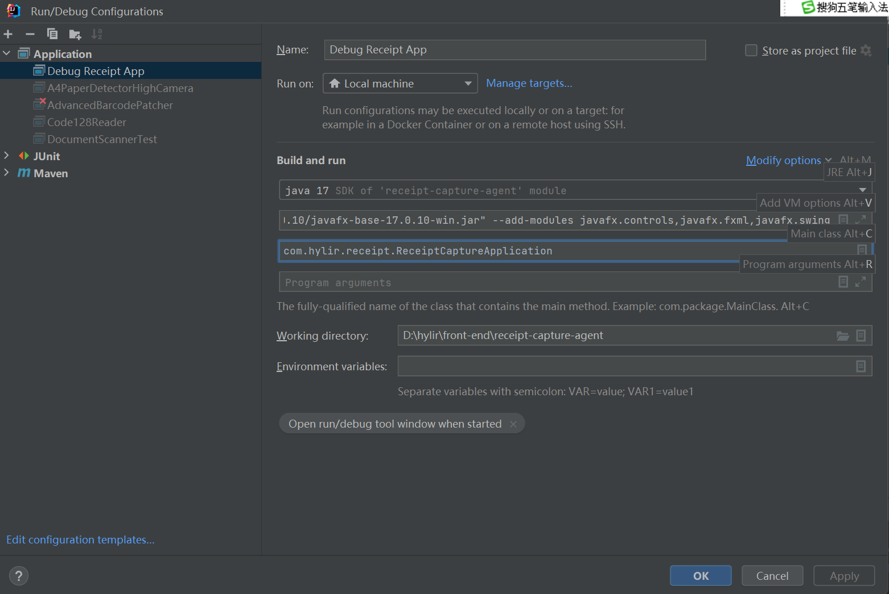
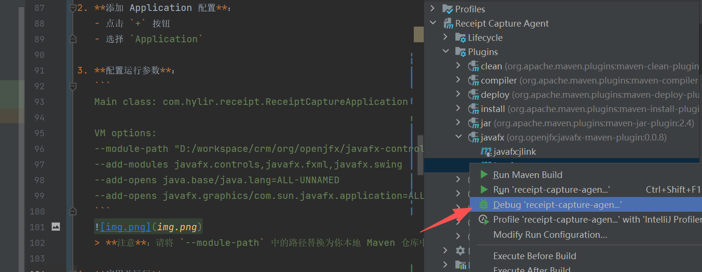

# Receipt Capture Agent (回单采集终端)

## 项目概述

Receipt Capture Agent 是一款专为仓库/工厂送货回单拍照和条码识别设计的 Windows 桌面应用程序。使用高拍仪实时预览采集图片，自动检测 A4 纸张区域并识别条码，支持手动输入单号后上传到后端系统。

## 核心功能

- **实时预览**：支持高拍仪实时预览画面
- **自动检测**：自动检测 A4 纸张区域并进行透视矫正
- **条码识别**：使用 ZXing 识别一维码（CODE128、CODE39、EAN13 等）
- **手动输入**：识别失败时支持人工输入单号
- **自动上传**：识别成功后自动上传图片和结果到后端
- **调试功能**：预览时自动保存原始帧和矫正后的图片到临时目录

## 技术栈

| 技术 | 用途 |
|-----|------|
| Java 17 | 开发语言 |
| JavaFX 17 | UI 框架 |
| OpenCV / JavaCV | 摄像头采集 |
| ZXing | 条码识别 |
| OkHttp | HTTP 客户端 |
| Jackson | JSON 处理 |
| Maven | 构建工具 |
| SLF4J + Logback | 日志 |

## 项目结构

```
src/main/java/com/hylir/receipt/
├── ReceiptCaptureApplication.java      # 主应用入口
├── config/
│   ├── AppConfig.java                  # 应用配置管理
│   └── ConfigManager.java              # 配置管理器
├── controller/
│   ├── MainController.java             # 主界面控制器
│   ├── ImageDetailController.java      # 图片详情控制器
│   └── SettingsController.java         # 设置控制器
├── model/
│   └── CaptureResult.java              # 采集结果模型
└── service/
    ├── CameraService.java              # 摄像头服务（门面类）
    ├── BarcodeRecognitionService.java  # 条码识别服务
    ├── UploadService.java              # 上传服务
    ├── autocapture/                    # 自动采集相关
    │   ├── AutoCaptureService.java     # 自动采集服务
    │   └── CapturePipeline.java        # 采集管线
    ├── barcode/                        # 条码识别实现
    │   ├── ZXingRecognitionEngine.java # ZXing 识别引擎
    │   └── OpenCVImagePreprocessor.java # 图像预处理
    └── camera/                         # 摄像头底层实现
        ├── CameraDeviceManager.java    # 设备管理
        ├── CameraGrabberManager.java   # 抓取器管理
        ├── CameraStreamService.java    # 视频流服务
        └── CameraCaptureService.java   # 拍照服务

src/main/resources/
├── config/
│   └── application.properties          # 配置文件
├── fxml/
│   ├── MainView.fxml                   # 主界面布局
│   ├── ImageDetailView.fxml            # 图片详情布局
│   └── SettingsView.fxml               # 设置界面布局
└── css/
    └── application.css                 # 样式文件
```

## 快速开始

### 环境要求

- Windows 10/11
- Maven 3.6+
- IntelliJ IDEA 2023+
- 高拍仪设备（如得力 GK122）

### 开发调试

**⚠️ 重要：必须使用 IntelliJ IDEA 的 Application 运行配置，不能使用 `mvn javafx:run`，否则无法进行断点调试。**

#### IDEA 运行配置步骤

1. **打开运行配置面板**：`Run → Edit Configurations...` 或 `Alt+Shift+F10` → `Edit Configurations`

2. **添加 Application 配置**：
   - 点击 `+` 按钮
   - 选择 `Application`

3. **配置运行参数**：
   ```
   Main class: com.hylir.receipt.ReceiptCaptureApplication

   VM options:
   --module-path "D:/workspace/crm/org/openjfx/javafx-controls/17.0.10/javafx-controls-17.0.10-win.jar;D:/workspace/crm/org/openjfx/javafx-fxml/17.0.10/javafx-fxml-17.0.10-win.jar;D:/workspace/crm/org/openjfx/javafx-swing/17.0.10/javafx-swing-17.0.10-win.jar;D:/workspace/crm/org/openjfx/javafx-graphics/17.0.10/javafx-graphics-17.0.10-win.jar;D:/workspace/crm/org/openjfx/javafx-base/17.0.10/javafx-base-17.0.10-win.jar"
   --add-modules javafx.controls,javafx.fxml,javafx.swing
   --add-opens java.base/java.lang=ALL-UNNAMED
   --add-opens javafx.graphics/com.sun.javafx.application=ALL-UNNAMED
   ```
   
   也可以这样运行
   
   > **注意**：请将 `--module-path` 中的路径替换为你本地 Maven 仓库中 JavaFX JAR 的实际路径。

4. **应用并运行**：
   - 点击 `Apply` → `OK`
   - 选择配置 → 点击 `Run` 或 `Debug` 按钮启动

#### 快速编译

```bash
# 编译项目（不运行）
mvn clean compile
```

### 构建安装包

```bash
# 1. 确保已安装 WiX Toolset 3.0+ (用于生成 exe)
#    下载地址: https://wixtoolset.org/releases/

# 2. 打包为可执行 JAR
mvn clean package -DskipTests

# 3. 生成 Windows 安装包 (exe)
mvn jpackage:jpackage
```

生成的安装包位置：`target/jpackage/Receipt_Capture_Agent-1.0.0.exe`

## 使用说明

1. **安装运行**：双击 `Receipt_Capture_Agent-1.0.0.exe` 完成安装
2. **选择设备**：从下拉框选择高拍仪设备
3. **点击预览**：启动实时预览画面
4. **自动检测**：将 A4 送货单放在摄像头前，系统自动检测并识别条码
5. **手动输入**：如识别失败，可点击"手动输入"按钮
6. **上传**：确认单号后点击"上传"按钮

### 快捷键

- **F6** - 自动检测并识别条码

### 调试模式

预览模式下会自动保存图片到临时目录：
- `C:\Users\<用户名>\AppData\Local\Temp\receipt-capture\`
- 包含原始帧图片 (`preview_raw_*.png`)
- 包含 A4 矫正后图片 (`preview_corrected_*.png`)

## 配置说明

### application.properties

```properties
# 后端 API 配置
backend.url=http://localhost:8080
backend.upload.endpoint=/api/receipt/upload

# HTTP 超时配置（毫秒）
http.connection.timeout=30000
http.read.timeout=60000

# 摄像头配置
camera.width=1920
camera.height=1080
```

### 运行时配置

安装目录下的 `receipt-capture-agent.cfg` 文件可配置 JVM 参数：

```properties
--add-opens java.base/java.lang=ALL-UNNAMED
```

## 后端接口规范

### 上传接口

**端点**: `POST /api/receipt/upload`

**类型**: `multipart/form-data`

**参数**:

| 参数 | 类型 | 说明 |
|-----|------|-----|
| image | File | 图片文件 (PNG) |
| receiptNumber | String | 送货单号 |
| captureTime | String | 采集时间 (ISO 8601) |
| recognitionSuccess | Boolean | 识别是否成功 |

**响应示例**:
```json
{
    "success": true,
    "message": "上传成功",
    "receiptId": "RC202401190001"
}
```

## 常见问题

### 摄像头连接失败
- 检查高拍仪是否正确连接
- 确认设备驱动已安装
- 在设备管理器中检查摄像头状态

### 条码识别失败
- 确保条码完整可见
- 调整光线避免反光
- 检查条码类型是否支持

### 网络连接失败
- 检查后端服务是否运行
- 确认防火墙允许访问
- 验证后端 URL 配置正确

## 部署

### 用户部署（推荐）

1. 双击 `Receipt_Capture_Agent-1.0.0.exe`
2. 按安装向导完成安装
3. 运行桌面快捷方式启动程序

### 开发者打包

```bash
# 完整构建流程
mvn clean package jpackage:jpackage -DskipTests

# 输出目录
# - JAR: target/receipt-capture-agent-1.0.0.jar
# - EXE: target/jpackage/Receipt_Capture_Agent-1.0.0.exe
```

## 许可证

MIT License
